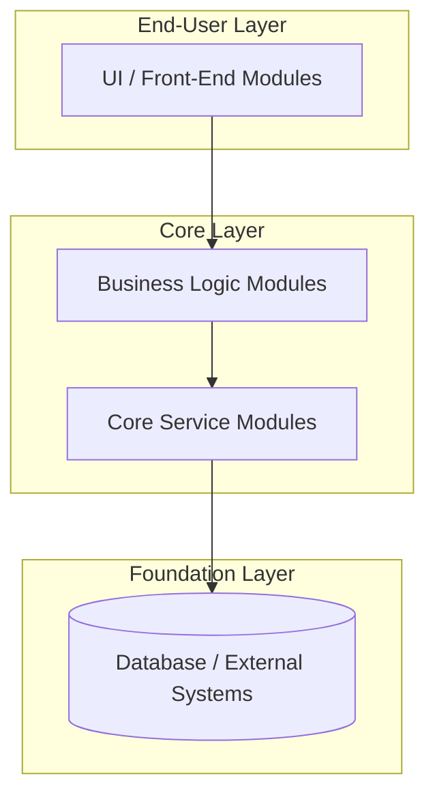
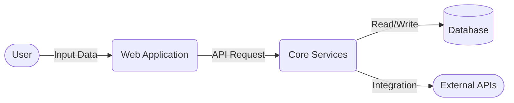
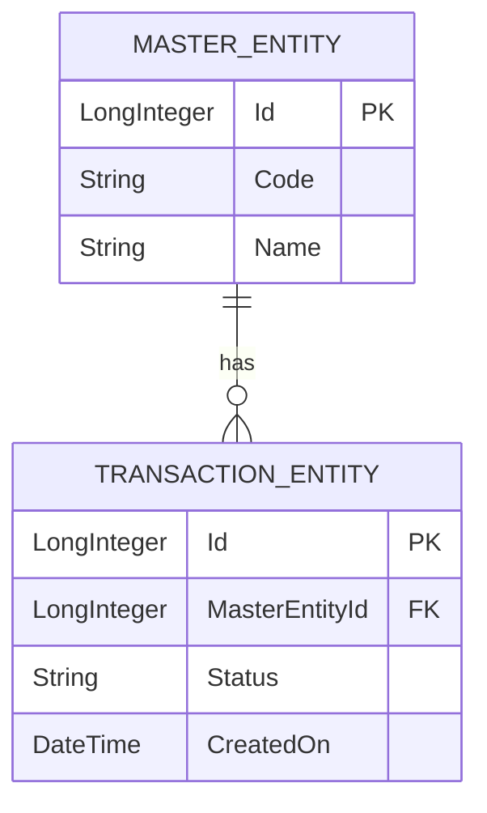
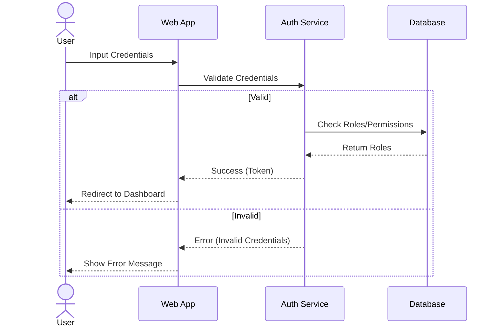
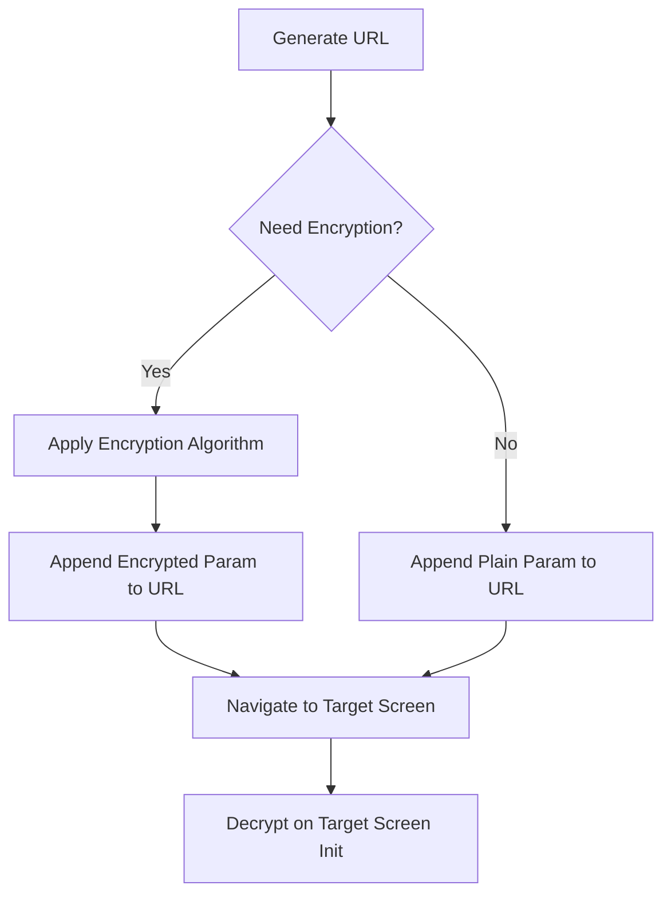

# Technical Specification Document Template

> **Pedoman AI Function Calling**:
> Setiap placeholder `[AI Generated | Function: ...]` menandakan sumber data dan pemanggilan fungsi (*tool call*) yang harus dieksekusi oleh AI Agent untuk mengisi konten dokumentasi secara faktual dan akurat.

---

## 1. Project Overview

### 1.1 Project General Information
| Field | Detail |
|---|---|
| Project Name | [AI Generated | Function: get_project_detail(project_id) -> project_name | Detail: Insert the full name of the project] |
| OutSystems Platform | [AI Generated | Function: get_project_detail(project_id) -> platform | Detail: Insert OutSystems platform type/version, e.g., ODC / O11] |
| Business Unit / Client | [AI Generated | Function: get_project_detail(project_id) -> business_unit | Detail: Insert target business unit or client name] |
| Project Manager | [AI Generated | Function: get_project_detail(project_id) -> project_manager | Detail: Insert Project Manager's name] |
| Technical Leader | [AI Generated | Function: get_project_detail(project_id) -> technical_leader | Detail: Insert Technical Leader's name] |
| Project Start Date | [AI Generated | Function: get_project_detail(project_id) -> start_date | Detail: Insert target or actual start date] |
| Target Go-Live Date | [AI Generated | Function: get_project_detail(project_id) -> go_live_date | Detail: Insert target go-live date] |
| Document Version | [AI Generated | Function: get_project_detail(project_id) -> doc_version | Detail: Insert document version, e.g., 1.0] |
| Document Status | [AI Generated | Function: get_project_detail(project_id) -> doc_status | Detail: Insert document status, e.g., Draft / Final] |

### 1.2 Description and Project Scope

**Background**
[AI Generated | Function: get_project_detail(project_id) -> background (fallback: AI synthesis from get_application_detail) | Detail: Provide a brief background of the project. Explain the business problem, current manual processes, and why this application is being developed.]

**Objectives**
[AI Generated | Function: get_project_detail(project_id) -> objectives (fallback: AI synthesis from core module actions) | Detail: Bullet point list of 3-5 technical and functional objectives, e.g., workflow efficiency, data compliance, role-based access, automated notifications.]

**In-Scope Features**
| # | Feature / Module | Description |
|---|---|---|
| 1 | [AI Generated | Function: get_application_detail(application_id) -> modules[i].name | Detail: Feature / Module Name] | [AI Generated | Function: get_module_actions(module_id) -> actions | Detail: Brief description of the feature's function and business value synthesized from module actions] |
| 2 | [AI Generated | Function: get_application_detail(application_id) -> modules[i].name | Detail: Feature / Module Name] | [AI Generated | Function: get_module_actions(module_id) -> actions | Detail: Brief description of the feature's function and business value synthesized from module actions] |
| 3 | [AI Generated | Function: get_application_detail(application_id) -> modules[i].name | Detail: Feature / Module Name] | [AI Generated | Function: get_module_actions(module_id) -> actions | Detail: Brief description of the feature's function and business value synthesized from module actions] |

---

## 2. OutSystems Application Architecture

### 2.1 3-Layer Architecture Canvas

[AI Generated | Function: get_application_detail(application_id) -> modules (grouped by suffix: _WEB/_MOB, _BL, _CS, _IS/_TH) | Detail: Provide a brief summary of how the End-User, Core, and Foundation layers are distributed in this application based on module architecture suffixes.]

### 2.2 Application & Module Definitions
| Parent Application | Module Name | Layer | Description |
|---|---|---|---|
| [AI Generated | Function: get_application_detail(application_id) -> name | Detail: App Name] | [AI Generated | Function: get_application_detail(application_id) -> modules[i].name | Detail: Target UI Module] | End-User | [AI Generated | Function: get_module_info(module_id) -> module_type, suffix | Detail: Main UI screens, client interactions, and user flows] |
| [AI Generated | Function: get_application_detail(application_id) -> name | Detail: App Name] | [AI Generated | Function: get_application_detail(application_id) -> modules[i].name | Detail: Target BL Module] | Core | [AI Generated | Function: get_module_info(module_id) -> module_type, suffix | Detail: Business Logic orchestration and validations] |
| [AI Generated | Function: get_application_detail(application_id) -> name | Detail: App Name] | [AI Generated | Function: get_application_detail(application_id) -> modules[i].name | Detail: Target CS Module] | Core | [AI Generated | Function: get_module_info(module_id) -> module_type, suffix | Detail: Core Services, CRUD operations, and Entity Data Access] |

### 2.3 Theme & UI Framework
[AI Generated | Function: get_module_info(module_id) -> user_provider_espace, web_screen_rendering_mode | Detail: Specify the base UI theme used, e.g., OutSystems UI, Custom Company Theme (_TH/_DR), and screen rendering mode.]

### 2.4 Forge Components
| Component Name | Used in Module | Purpose / Description |
|---|---|---|
| [AI Generated | Function: get_application_detail(application_id) -> modules (identified third-party/forge modules) | Detail: Component Name] | [AI Generated | Function: get_application_detail(application_id) -> modules[i].name | Detail: Module consuming the component] | [AI Generated | Function: get_module_actions(module_id) / get_module_info(module_id) | Detail: Purpose of the forge component, e.g., Export Excel, AWS S3 Integration, Ultimate PDF] |

### 2.5 Environment Landscape
| Environment | URL / Server | Remarks |
|---|---|---|
| Development | [AI Generated | Function: get_module_site_properties(module_id, search="Environment") / get_project_detail(project_id) | Detail: Dev Environment URL / Hostname] | [AI Generated | Function: get_project_detail(project_id) | Detail: Dev Environment Remarks] |
| UAT | [AI Generated | Function: get_module_site_properties(module_id, search="Environment") / get_project_detail(project_id) | Detail: UAT Environment URL / Hostname] | [AI Generated | Function: get_project_detail(project_id) | Detail: UAT Environment Remarks] |
| Production | [AI Generated | Function: get_module_site_properties(module_id, search="Environment") / get_project_detail(project_id) | Detail: Prod Environment URL / Hostname] | [AI Generated | Function: get_project_detail(project_id) | Detail: Prod Environment Remarks] |

### 2.6 Application URL & Routing
| Entry Module | Base URL | Remarks / Routing Rule |
|---|---|---|
| [AI Generated | Function: get_module_info(module_id) -> name | Detail: Entry Module Name] | [AI Generated | Function: get_module_info(module_id) -> name (lowercase url path) | Detail: URL Path, e.g., /OrderManagement_WEB] | [AI Generated | Function: get_module_info(module_id) -> default_transition, web_screen_rendering_mode | Detail: Routing specifics, screen rendering mode, and default transitions] |

---

## 3. Integrations & Interfaces

### 3.1 Impacted System's Changes Requirement
| System Name | Changes Required | PIC / Owner |
|---|---|---|
| [AI Generated | Function: get_module_service_actions(module_id) / get_module_structures(module_id) | Detail: External System Name identified from service integrations] | [AI Generated | Function: get_module_service_actions(module_id) -> description | Detail: Brief description of changes needed in the external system] | [AI Generated | Function: get_project_detail(project_id) -> technical_leader | Detail: Owner / Technical PIC Name] |

### 3.2 Consumed APIs (REST/SOAP)
| API Name | Method | Endpoint / URL | Authentication | Business Purpose |
|---|---|---|---|---|
| [AI Generated | Function: get_module_service_actions(module_id, search="API") / get_module_actions(module_id) | Detail: Consumed API Name] | [AI Generated | Function: get_module_actions(module_id) / get_module_structures(module_id) | Detail: GET / POST / PUT] | [AI Generated | Function: get_module_site_properties(module_id, search="URL") | Detail: Endpoint URL or Site Property reference] | [AI Generated | Function: get_module_site_properties(module_id, search="Token") / get_module_actions(module_id) | Detail: Basic / Bearer Token / API Key] | [AI Generated | Function: get_module_actions(module_id) -> description | Detail: Purpose of consuming this external API] |

### 3.3 Exposed API (REST/SOAP)
| API Name | Method | Endpoint / URL | Authentication | Business Purpose |
|---|---|---|---|---|
| [AI Generated | Function: get_module_service_actions(module_id) -> service_actions[i].Name | Detail: Exposed API / Service Action Name] | [AI Generated | Function: get_module_service_actions(module_id) -> Method | Detail: POST / Service Action Call] | [AI Generated | Function: get_module_service_actions(module_id) -> Endpoint / Key | Detail: Endpoint / Service Action identifier] | [AI Generated | Function: get_module_info(module_id) -> user_provider_espace | Detail: Internal Token / Session / Custom Header] | [AI Generated | Function: get_module_service_actions(module_id) -> service_actions[i].Description | Detail: Purpose of exposing this API for inter-module / external communication] |

### 3.4 External DB Connections
| Database Name | DB Type | Schema | Purpose |
|---|---|---|---|
| [AI Generated | Function: get_module_entities(module_id, is_static=false) (external entities) | Detail: External Database Name / Integration Name] | [AI Generated | Function: get_module_entities(module_id) | Detail: SQL Server / Oracle / PostgreSQL] | [AI Generated | Function: get_module_entities(module_id) | Detail: Schema Name / Read-Only View] | [AI Generated | Function: get_module_entities(module_id) -> description | Detail: Reason for connection / Master data synchronization] |

### 3.5 Data Flow (Transaction & Master)

[AI Generated | Function: get_module_entities(module_id) + get_module_actions(module_id) + get_module_service_actions(module_id) | Detail: Brief explanation of how data moves through the system between UI modules, Core Services, Database tables, and external integrations.]

---

## 4. Data & Logic Design

### 4.1 Entity Relationship Diagram (ERD)

> *Catatan AI Generator: Generate Mermaid ERD secara dinamis menggunakan daftar entitas dan atribut foreign key (`*Id`) dari `get_module_entities(module_id)` atau `search_application_entities(application_id)`.*

### 4.2 Database Information & Entities
*(Repeat this block for each major entity)*

**Entity: [AI Generated | Function: get_module_entities(module_id) -> entities[i].Name | Detail: Entity Name]**
*Business Purpose:* [AI Generated | Function: get_module_entities(module_id) -> entities[i].Description | Detail: Explain what business concept this table represents] 
*Archiving Strategy:* [AI Generated | Function: get_module_entities(module_id) -> entities[i].Attributes (check IsActive / CreatedOn / Status) | Detail: Define data retention and archiving strategy, e.g., Soft Delete via IsActive or Annual Partitioning]

| Attribute Name | Data Type | Mandatory | Length | Description |
|---|---|---|---|---|
| Id | Long Integer | Yes | - | Primary Key |
| [AI Generated | Function: get_module_entities(module_id) -> attributes[j].Name | Detail: Attribute Name] | [AI Generated | Function: get_module_entities(module_id) -> attributes[j].DataType | Detail: Text / LongInteger / Identifier / DateTime / Boolean] | [AI Generated | Function: get_module_entities(module_id) -> attributes[j].IsMandatory | Detail: Yes / No] | [AI Generated | Function: get_module_entities(module_id) -> attributes[j].Length | Detail: Max length if text, otherwise '-'] | [AI Generated | Function: get_module_entities(module_id) -> attributes[j].Description | Detail: Attribute business description] |

### 4.3 Timers and Background Processes

**Timers**
| Timer Name | Action | Schedule | Business Purpose |
|---|---|---|---|
| [AI Generated | Function: get_module_actions(module_id, search="Timer") -> actions[i].Name | Detail: Timer Name] | [AI Generated | Function: get_module_actions(module_id) -> actions[i].Name | Detail: Executed Server Action] | [AI Generated | Function: get_module_site_properties(module_id, search="Schedule") / get_module_actions(module_id) | Detail: Frequency, e.g., Daily at 02:00 UTC] | [AI Generated | Function: get_module_actions(module_id) -> actions[i].Description | Detail: Describe what background batch job this timer performs] |

**Processes (BPT)**
| Process Name | Launch On | Business Purpose / Workflow |
|---|---|---|
| [AI Generated | Function: get_module_actions(module_id, search="Process") / get_module_info(module_id) | Detail: BPT / Process Name] | [AI Generated | Function: get_module_entities(module_id) -> (Create / Update event trigger) | Detail: Trigger Event, e.g., Entity.CreateBooking] | [AI Generated | Function: get_module_actions(module_id) -> description | Detail: Describe the multi-step business process workflow] |

### 4.4 Site Properties
| Site Property Name | Module | Default Value | Business Purpose |
|---|---|---|---|
| [AI Generated | Function: get_module_site_properties(module_id) -> site_properties[i].Name | Detail: Property Name] | [AI Generated | Function: get_module_info(module_id) -> name | Detail: Module Name] | [AI Generated | Function: get_module_site_properties(module_id) -> site_properties[i].DefaultValue | Detail: Default / Runtime Value] | [AI Generated | Function: get_module_site_properties(module_id) -> site_properties[i].Description | Detail: Business purpose of runtime configuration] |

### 4.5 Date, Time and Timezone Configurations
[AI Generated | Function: get_module_site_properties(module_id, search="Timezone") / get_module_info(module_id) | Detail: Specify Timezone settings, e.g., Default OutSystems Server Time (UTC), Application Timezone conversion logic.]

---

## 5. Security, Entitlement and Compliance

### 5.1 Authentication
**Authentication Configuration**
| Configuration | Value |
|---|---|
| Auth Method | [AI Generated | Function: get_module_info(module_id) -> user_provider_espace | Detail: OutSystems Default (Users), SAML 2.0, Azure AD, or Custom Provider] |
| Login Module | [AI Generated | Function: get_module_info(module_id) -> user_provider_espace | Detail: Module handling login credentials and token generation] |
| Post-Login Redirect | [AI Generated | Function: get_module_actions(module_id, search="Login") / get_module_info(module_id) | Detail: Default landing screen, e.g., /Dashboard] |
| Password Policy | [AI Generated | Function: get_module_info(module_id) -> user_provider_espace | Detail: OutSystems Built-in Policy (Min 8 chars, alphanumeric) or IdP Controlled] |

**Login Flow Diagram**

**Account Lockout Mechanism**
[AI Generated | Function: get_module_actions(module_id, search="User") / get_module_info(module_id) -> user_provider_espace | Detail: Describe lockout rules, e.g., Max 3 invalid attempts, lockout duration 30 minutes, or delegated to Active Directory.]

### 5.2 Entitlement / Authorization (Custom Roles)
| Role Name | Description | Assigned To (Jabatan/Fungsi) |
|---|---|---|
| [AI Generated | Function: get_module_system_roles(module_id) -> system_roles[i].Name | Detail: Custom Role Name] | [AI Generated | Function: get_module_system_roles(module_id) -> system_roles[i].Description | Detail: Role permissions and access boundaries] | [AI Generated | Function: get_module_system_roles(module_id) -> system_roles[i].Name | Detail: Business Job Title / User Group mapped to role] |

### 5.3 Document & Binary Storage Strategy
| Configuration | Value |
|---|---|
| Storage Strategy | [AI Generated | Function: get_module_entities(module_id, search="Binary") / get_module_site_properties(module_id, search="S3") | Detail: OutSystems Database (Binary Data Attribute), AWS S3, or Azure Blob] |
| Max File Size | [AI Generated | Function: get_module_site_properties(module_id, search="FileSize") / get_module_actions(module_id, search="Upload") | Detail: e.g., 5 MB - 10 MB per file] |
| Allowed File Types | [AI Generated | Function: get_module_actions(module_id, search="Upload") / get_module_structures(module_id) | Detail: e.g., PDF, JPG, PNG, XLSX, DOCX] |
| Virus Scanning | [AI Generated | Function: get_module_service_actions(module_id, search="Scan") / get_module_actions(module_id) | Detail: Integration with Anti-Virus API / Lambda or N/A] |

### 5.4 Global Exception & Error Handling
| Error Type | Handler Location | User-Facing Message | Logged? | Alert Sent? |
|---|---|---|---|---|
| [AI Generated | Function: get_module_exceptions(module_id) -> exceptions[i].Name | Detail: Exception Name, e.g., UserException, ValidationException] | [AI Generated | Function: get_module_info(module_id) -> name | Detail: Module / Action Name handling the exception] | [AI Generated | Function: get_module_exceptions(module_id) -> exceptions[i].Description | Detail: Generic sanitized feedback message shown to end users] | [AI Generated | Function: get_module_exceptions(module_id) | Detail: Yes (OutSystems Error Log / Service Center)] | [AI Generated | Function: get_module_actions(module_id, search="Notify") | Detail: Yes / No (Email / Teams / Slack notification)] |

### 5.5 URL Parameter Security

**URL Encryption Flow**

### 5.6 Session Management
| Configuration | Value |
|---|---|
| Session Timeout (Idle) | [AI Generated | Function: get_module_site_properties(module_id, search="Timeout") / get_module_info(module_id) | Detail: e.g., 20 - 30 Minutes idle timeout] |
| Concurrent Session Allowed | [AI Generated | Function: get_module_info(module_id) -> use_cookies | Detail: Allowed / Single Session Policy via Session Token] |

### 5.7 Credential and Sensitive Information Management
[AI Generated | Function: get_module_site_properties(module_id) -> site_properties | Detail: Explain where API keys, Secrets, and sensitive DB credentials are stored securely (e.g., IsSecret Site Properties in Service Center, Azure Key Vault, or OutSystems Key Management).]

---

## 6. Deployment
| Step | Manual Instruction / Script | Target Environment | PIC |
|---|---|---|---|
| 1 | [AI Generated | Function: get_application_detail(application_id) -> modules (ordered by dependencies: CS -> BL -> WEB) | Detail: Standard deployment via LifeTime or CI/CD pipeline in sequence: Core Services -> Business Logic -> Web/Mobile Front-End] | All Environments | [AI Generated | Function: get_project_detail(project_id) -> technical_leader | Detail: DevOps / Technical Lead] |

---

## 7. Appendix
[AI Generated | Function: get_project_detail(project_id) + list_applications() | Detail: Add OutSystems Architecture references, Service Center links, glossary terms, or related OAP/OML artifact documents.]

